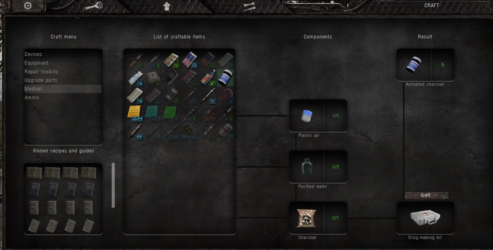
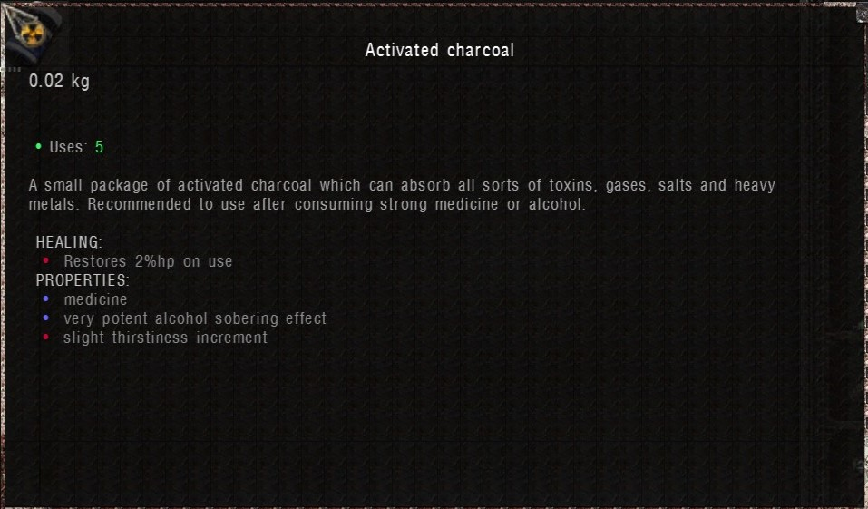
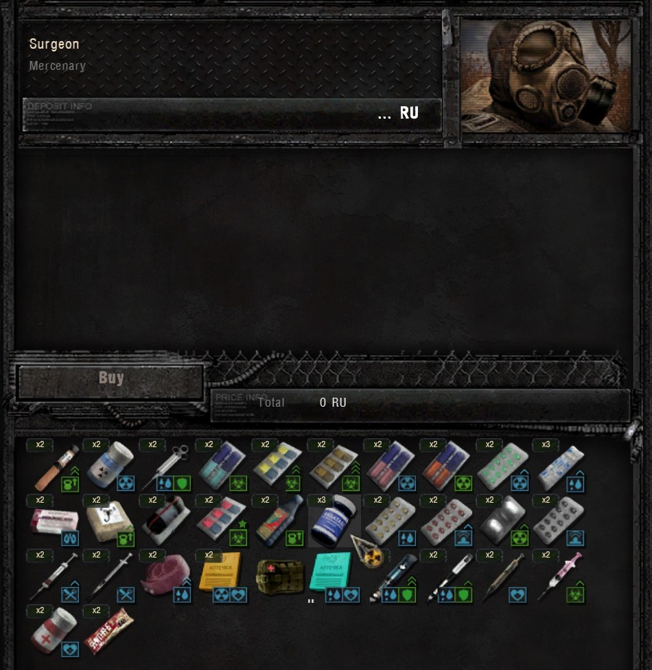
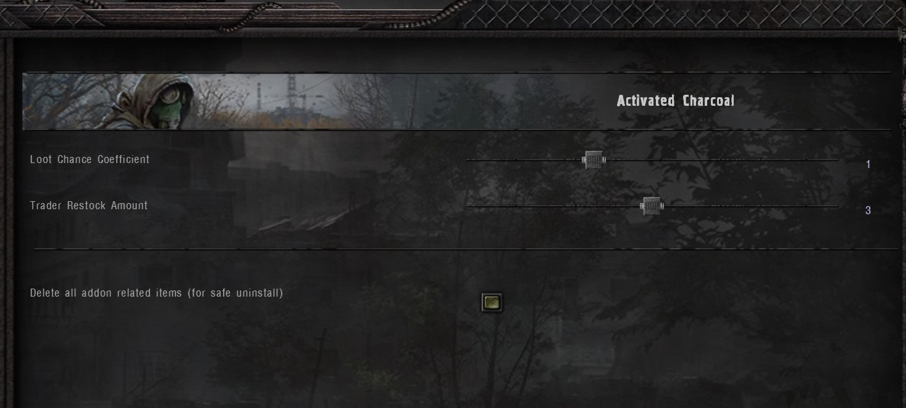

# Activated Charcoal

 
 

**_Note: If you have any suggestions write me a [DM](https://www.moddb.com/messages/compose?to=Tosox) on Moddb or Discord \[Tosox#0573\]_**

## Description

* This mod brings the [Dead Air](https://www.moddb.com/mods/dead-air/) drug "Activated Charcoal" to Anomaly.  
* You can find the drug on corpses, buy it from medics, or make it yourself.  
* It's mainly used to remove the dizziness effect e.g. after taking Yadulin or drinking vodka.

## Installation

* Make sure that [FDDA](https://www.moddb.com/mods/stalker-anomaly/addons/food-drug-and-drinks-animations-reuploaded) and [DLTX](https://www.moddb.com/mods/stalker-anomaly/addons/152-dltxshader-scopessss-combined-modified-binaries-link-in-description) are installed
* Download the latest release
* Install the mod preferably with [Mod Organizer 2](https://github.com/ModOrganizer2/modorganizer/releases/)
* Open the game and enjoy

## Preview

## FAQ

### Is it compatible with addon _xy_?
- Yes. There may be a conflict with a "trader_autoinject.script" file. However, overwriting the file does not cause any problems.

### Will the addon be updated in the future?
- Only time can tell.

## Credits
- [Igigog](https://www.moddb.com/members/igigog) for helping me with the russian translation
- [Arti](https://www.moddb.com/members/artifax) for his trader autoinject script
